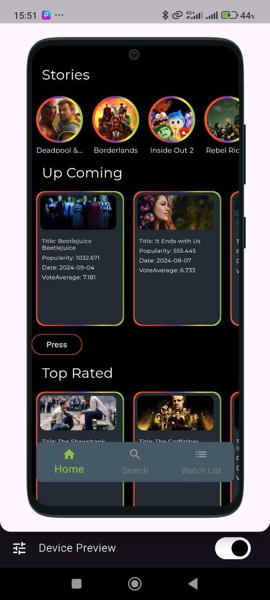
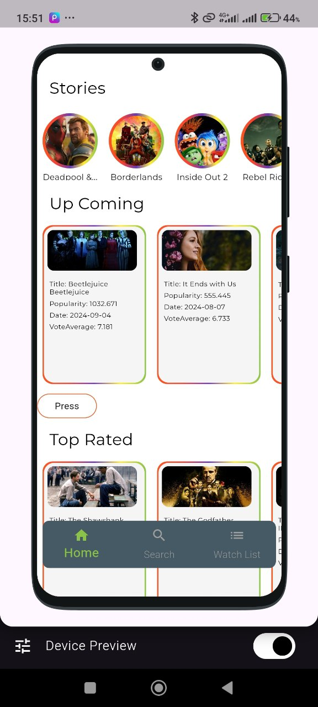

# movie_app

A new Flutter project.

## Getting Started

This project is a starting point for a Flutter application.

A few resources to get you started if this is your first Flutter project:

- [Lab: Write your first Flutter app](https://docs.flutter.dev/get-started/codelab)
- [Cookbook: Useful Flutter samples](https://docs.flutter.dev/cookbook)

Here's an advanced README content template for your Movie App project on GitHub:

---

# Movie App

**Movie App** is a highly performant and feature-rich mobile application built using **Flutter** and **Dart**. This app provides a seamless user experience for browsing, discovering, and saving movies with advanced capabilities like localization, theme switching, state management, and secure local storage.

## Features

- **Multilingual Support (Localization)**: Fully localized with support for multiple languages using Flutter's ARB file structure.
- **Dynamic Theme Management**: Provides users with the option to switch between light and dark themes, ensuring a personalized experience.
- **State Management**: Powered by **Riverpod**, ensuring efficient and scalable state management with fine-grained control over state changes.
- **MVVM Architecture**: Implements a clean **Model-View-ViewModel (MVVM)** architecture, promoting separation of concerns, testability, and maintainability.
- **Secure Local Storage**: Uses **Shared Preferences** and **Flutter Secure Storage** to store user settings, preferences, and sensitive data securely.
- **Dio for API Calls**: Uses **Dio** for making robust network requests with features like interceptors, global error handling, and caching.
- **Offline Support**: Integrated local storage mechanisms to enable offline access to user data and saved movie lists.

## Technologies Used

- **Flutter**: A UI toolkit for building natively compiled applications for mobile, web, and desktop from a single codebase.
- **Dart**: The language used to write Flutter apps, optimized for fast apps on any platform.
- **Riverpod**: State management library that ensures scalability and modular code architecture.
- **MVVM Architecture**: Ensures a clear separation of the app’s logic from the UI, making the app easier to test and maintain.
- **Localization**: Supports multiple languages using ARB files, providing a better experience for global users.
- **Shared Preferences**: Stores non-sensitive user data, such as settings and preferences.
- **Flutter Secure Storage**: Securely stores sensitive user data, such as authentication tokens and user-specific settings.
- **Dio**: A powerful HTTP client used for making efficient and customizable API requests.

## Project Structure

The project is structured following the **MVVM** pattern, which divides the app into:

- **Model**: Represents the data and business logic.
- **View**: The UI components (Flutter widgets) that display data to the user.
- **ViewModel**: Manages the state of the View and handles interactions between the View and Model.

```
lib/
│
├── generated/           # Generated files (e.g., asset generator)
├── l10n/                # ARB files for localization
├── src/                 # Main source code folder
│   ├── core/            # Core functionality
│   │   ├── constants/   # Application constants
│   │   ├── widgets/     # Reusable widgets
│   │   ├── style/       # Theme and style definitions
│   │   ├── storage/     # Local storage handling (Shared Preferences, Secure Storage)
│   │   └── server/      # Server configuration and API services (e.g., using Dio)
│   │   └── routes/      # App navigation and route definitions
│   ├── data/            # Data handling layer
│   │   ├── entity/      # Data models and entities
│   │   └── repository/  # Repository pattern for data management
│   ├── feature/         # Feature-specific code
│   │   ├── auth/        # Authentication module
│   │   ├── entry/       # Entry module (e.g., onboarding, splash screen)
│   │   ├── home/        # Home screen module
│   │   └── setting/     # Settings screen module
├── main.dart            # Main entry point of the app
├── riverpod.dart        # Global Riverpod providers setup
├── runner.dart          # App runner (main app configurations)

```

## Installation

To install and run the Movie App on your local machine, follow these steps:

1. Clone the repository:
   ```bash
   git clone https://github.com/Zafarbek708k/movie_app.git
   cd movie_app
   ```

2. Install dependencies:
   ```bash
   flutter pub get
   ```

3. Run the app:
   ```bash
   flutter run
   ```

## API Integration

The app integrates with a third-party movie API to fetch data for movies, genres, and other related information. All network requests are handled using the **Dio** package, with a focus on error handling and API response caching for better performance.

## State Management

The app uses **Riverpod** for state management, ensuring optimal performance with fine control over state and data flow throughout the app. Riverpod was chosen for its flexibility and better testability compared to other state management solutions.

## Security

Sensitive data such as authentication tokens and user preferences are securely stored using **Flutter Secure Storage**, ensuring that no sensitive information is exposed in plaintext.

## Offline Support

The app uses local storage mechanisms (such as **Shared Preferences**) to store user preferences and movie data, enabling a smooth experience even when the device is offline.

## Localization

Movie App is localized in multiple languages, including but not limited to:
- English
- Russian
- Uzbek

ARB files are used to manage translations efficiently, allowing easy expansion to additional languages in the future.

## Screenshots

Add screenshots to showcase the app's design and features.



## Contributing

Contributions are welcome! If you'd like to contribute to the project, please fork the repository, make your changes, and submit a pull request. Please ensure that your changes align with the project's architecture and coding standards.

## License

This project is licensed under the MIT License. See the [LICENSE](LICENSE) file for more details.

---

This README file provides an advanced and professional overview of your Movie App project, ideal for showcasing on GitHub!
